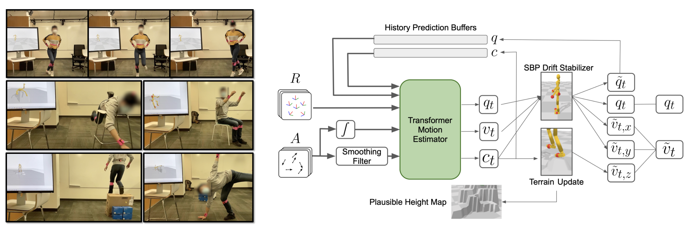
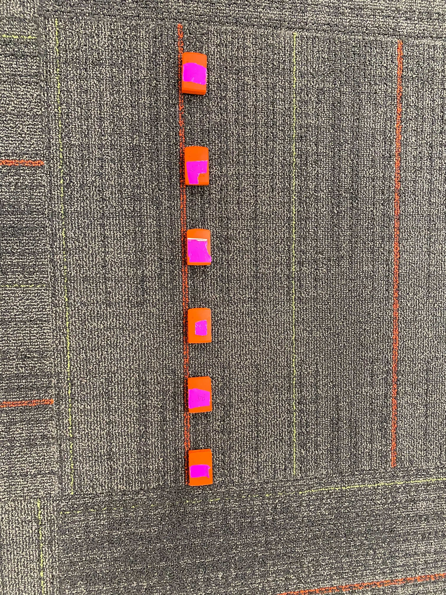

# Transformer Inertial Poser (TIP): Real-time Human Motion Reconstruction from Sparse IMUs with Simultaneous Terrain Generation

This is the Python implementation accompanying our TIP paper at SIGGRAPH Asia 2022.

Arxiv: https://arxiv.org/abs/2203.15720

Video: https://youtu.be/rXb6SaXsnc0

Copyright 2022 Meta Inc. and Stanford University

Licensed under the CC-BY-NC-4.0 License



## Environment Setup

(Only tested on Ubuntu 18.04; Might work on Windows with some minor modifications)

1.Go to (https://www.anaconda.com/download/) and install the Python 3 version of Anaconda or Miniconda.

2.Open a new terminal and run the following commands to create a new conda environment (https://docs.conda.io/projects/conda/en/latest/user-guide/tasks/manage-environments.html):

```conda create -n tip22 python=3.8```

3.Activate & enter the new environment you just creared:

```conda activate tip22```

4.Inside the new environment, and inside the project directory:

```pip install -r requirements.txt```

5.Install pytorch with CUDA (only tested with the following version, should work with other versions though):

```conda install pytorch==1.7.1 cudatoolkit=10.2 -c pytorch``` 	(check pytorch website for your favorite version)

6.Install our fork of the Fairmotion library, at a location you prefer:
```
git clone https://github.com/jyf588/fairmotion.git
cd fairmotion
pip install -e .
```

## Datasets and Models

### SMPL+H model

Download the SMPL model from https://psfiles.is.tuebingen.mpg.de/downloads/mano/smplh-tar-xz. Decompress and replace the empty ```data/smplh``` folder from this repo with the decompressed folder.

### AMASS

Download AMASS from https://amass.is.tue.mpg.de/download.php. ```SMPL+H``` is the file format we use, though no hand motions are generated by our algorithm. 

We only used a couple of subsets within AMASS to train the model; including more data synthesized from AMASS might improve performance, but we have not tried it. Decompress the datasets and place these folders ```AMASS_CMU, KIT, Eyes_Japan_Dataset, HUMAN4D, ACCAD, DFaust_67, HumanEva, MPI_Limits, MPI_mosh, SFU, Transitions_mocap, TotalCapture, DanceDB``` inside ```data/source/```

### Real IMU signals from DIP

Download DIP from https://psfiles.is.tuebingen.mpg.de/downloads/dip/DIPIMUandOthers_zip. Put the ```DIP_IMU``` folder inside ```data/source/```. This folder should contain both IMU signals and SMPL ground-truth poses, both of which we use to train the model together with synthesized AMASS data.

### Real IMU signals from TotalCapture (TC)

(Only used during eval. You could skip this if you are not interested in evaluating your trained model on real IMUs from TC.)

Check the licence terms and citation information for TotalCapture dataset: https://cvssp.org/data/totalcapture/.

Contact the DIP authors (https://github.com/eth-ait/dip18) to send you TC IMU signals preprocessed by them (in DIP format), the folder should carry the name “TotalCaputure_60FPS_Original”. The folder also packs Ground-Truth poses in old SMPL format which we do not use in this codebase -- we simply use SMPL poses from the TotalCapture included in AMASS. Put the ```TotalCaputure_60FPS_Original``` folder inside ```data/source/``` as well.

We provide an untested and uncleaned script ```viz_raw_DIP_TC.py``` which you can modify and use to visualize the raw IMU signals from DIP or TC.

## Data Processing and Training

1.Synthesize IMU signals from AMASS data, since AMASS only contains SMPL poses. Change the ```N_PROC``` and ```DATA_V_TAG``` arguments in the bash script according to your needs.

```
sh ./data-gen-new-scripts.bash
```

>Note 1: We cast the ground-truth poses into a format usually used by physics simulators, namely q and dq. But dq part is actually unfilled (zeros) except for the root linear velocity which the algorithm actually cares.

> Note 2: SBPs (refer paper for details) are also synthesized here. In data files they use the key name ```constrs```

> Note 3: We use URDF (a commonly used robotics specification file format) to specify the tree structure of human, and to specify locations where the IMUs are placed. You can easily modify those positions by searching ```IMU``` in ```data/amass.urdf```. Note though the root (pelvis) IMU location offset is specified instead in ```constants.py``` due to a limitation of PyBullet.

We provide an untested and uncleaned script ```viz_generated_sbp.py``` which you can modify and use to visualize the synthesized SBP data for AMASS.

2.Preprocess real IMU data from DIP (1st line) and TC (2nd line) into our own format

```
python preprocess_DIP_TC_new.py --is_dip --data_version_tag v1
python preprocess_DIP_TC_new.py --data_version_tag v1
```

> Note: we did two additional things to the DIP dataset: first as DIP do not have root motion, we use a pre-trained (trained without DIP) model to label pseudo ground-truth SBPs for the DIP motions. In this repo we omit this tedious step and directly provide the pre-trained SBP info to append to the DIP dataset; second we split subjects 1 to 8 for training and 9 to 10 for testing in this script, following previous works for fair comparison.

3.Combine both synthesized (AMASS subsets) and real (DIP subjects 1~8) data for training and do further pre-processing to save training time:

```
python preprocess_and_combine_syn_amass.py --data_version_tag v1
```

4.Training:
```
python -m train_model --save_path "output/model-new-v1-0" --log-interval 20 --seed 5104 --clip 5.0 --epochs 1100 --batch_size 256 --lr 1e-4 --seq_len 40 --rnn_nhid 512 --tf_nhid 1024 --tf_in_dim 256 --n_heads 16 --tf_layers 4 --in_dropout 0.0 --past_dropout 0.8 --weight_decay 1e-4 --cuda --cosine_lr --n_sbps 5 --with_acc_sum --data_version_tag "v1" --noise_input_hist 0.15 > "output/model-new-v1-0-out.txt" &
```

We did not do much search on the hyper parameters above -- feel free to do more sweeping on them.


5.Model Evaluations (ref. Table 1 in paper):

Test on DIP Subjects 9~10:
```
python offline_testing_simple.py --name_contains "dipimu_s_09 dipimu_s_10" --ours_path_name_kin output/model-new-v1-0.pt --with_acc_sum  --test_len 30000 --compare_gt --seed 42 --five_sbp
```

Test on real IMUs from TotalCapture:

```
python offline_testing_simple.py --name_contains "tcimu" --ours_path_name_kin output/model-new-v1-0.pt --with_acc_sum  --test_len 30000 --compare_gt --seed 42 --five_sbp
```

Test on synthesized DanceDB:

```
python offline_testing_simple.py --name_contains "DanceDB" --ours_path_name_kin output/model-new-v1-0.pt --with_acc_sum  --test_len 30000 --compare_gt --seed 42 --five_sbp
```

The commands above calls ```real_time_runner_minimal.py```, which runs core (i.e. minimal) test-time features of our algorithm. Specifically, it assumes a flat ground without terrain, and the learned SBPs are only used to correct root translational drift. This minimal version of our system is provided to lower the bar of understanding and adaptation. To use full features of our system, i.e. terrain reconstruction and SBP for joint motion correction (e.g. sitting), you would need to instead call ```real_time_runner.py```. This can be easily done by commenting/uncommenting the following two lines in ```offline_testing_simple.py```:
```
    # ours_out, c_out, viz_locs_out = test_run_ours_gpt_v4_with_c_rt(char, s_gt, imu, m, 40)
    ours_out, c_out, viz_locs_out = test_run_ours_gpt_v4_with_c_rt_minimal(char, s_gt, imu, m, 40)
```
 >Note: different from previous methods, our Transformer-decoder-based method does not have an offline mode that considers all future IMU readings when making the current pose estimation. Even in ```offline_testing_simple.py```, we pretend the pre-recorded IMU signal file is streaming into the system frame by frame. In other words, the system is always "real-time".

6. We release two pre-trained models. The first model, ```output/model-without-dip9and10.pt```, is produced exactly from the commands above, holding out subject 9 and 10 in real DIP data. The second model, ```output/model-with-dip9and10.pt``, includes subject 9 and 10 in training. While we shall not use this model for number reporting, we can use it for the real-time demo.

## Real-time Demo

(Only tested with six Xsens Awinda sensors, connected to a Windows workstation (though an Xsens station) with a decent GPU. Sorry we won't be able to provide much help for other setups. The paper's Appendix provide a detailed description of Calibration for real setups.)

1.Follow Environment Setup to set up a similar Conda environment on this Windows machine. Some of the python dependencies used during training are no longer needed, you could remove them in case you run into issues.

2.Download MT Software Suite 2021.4 (specific version probably doesn't matter): https://www.xsens.com/software-downloads (→ MTi products) and install it.

3.Connect your MTw Awinda sensors and base station to computer, run MT Manager and follow steps in this link until Step 5, to make sure your computer can successfully read the IMU signals https://base.xsens.com/s/article/Getting-started-with-MTw-and-MT-Manager-2019?language=en_US . Check the visualization to see if the readings make intuitive sense, to prevent using a bad sensor.

4.Get yourself familiar with the sensor coordinate system (e.g. sec. 11.6 for the Awinda manual): https://www.xsens.com/hubfs/Downloads/Manuals/MTw_Awinda_User_Manual.pdf. Also refer to the paper's Appendix.

5.Depending where you installed the MT Software Suite, replace C:\Program Files\Xsens\MT Software Suite 2021.4\MT SDK\Examples\xda_cpp\example_mtw.cpp with my file here: https://drive.google.com/file/d/1fiW9_PntFnsqrqNPp1AjEeG24hyTeavW/view?usp=sharing 

6.Open C:\Program Files\Xsens\MT Software Suite 2021.4\MT SDK\Examples\xda_cpp\xda_cpp.sln with Visual Studio with sudo/admin privileges (I used VS 2019), and run Local Windows Debugger with “Release, x64” profile, to start the C++ client which sends IMU signals over to the Python server (within same workstation, for sure).

7.Look at L550 of example_mtw.cpp, among the 6 IMUs we use, #0 will have the smallest device ID and #5 have the largest. We used the order (#0 (smallest ID): pelvis, #1: left wrist, #2: right wrist, #3: left knee, #4: right knee, #5 (largest ID): head) on the Python server side. Use markers/stickers to label your IMUs accordingly so that you don't wear them at the wrong order/location.

8.Now at Python server side run release/live_demo_new.py, if the C++ program is also running and constantly outputting current devices and their signals in the L550 format, the python server should be able to connect the C++ client and start streaming IMU signals in.

9.When the Python program prompts: “Put all imus aligned with your body reference frame and then press any key.” Think about which direction you will face towards when doing the T-pose calibration later, then put each IMU so that its x-axis is along your front, y-axis along your left, and z-axis along your up direction (Figure Below). When you finish placing all IMUs, press any key to start first-step calibration.



10.Follow the rest prompts from the Python program to do the T-pose calibration, after which the program should start running and you will see reconstructed motion visualized in PyBullet GUI.

## Citation
If you found this code or paper useful, please consider citing:
```
@inproceedings{TIP22,
author = {Jiang, Yifeng and Ye, Yuting and Gopinath, Deepak and Won, Jungdam and Winkler, Alexander W. and Liu, C. Karen},
title = {Transformer Inertial Poser: Real-Time Human Motion Reconstruction from Sparse IMUs with Simultaneous Terrain Generation},
year = {2022},
doi = {10.1145/3550469.3555428},
booktitle = {SIGGRAPH Asia 2022 Conference Papers},
articleno = {3},
numpages = {9},
keywords = {Wearable Devices, Human Motion, Inertial Measurement Units},
location = {Daegu, Republic of Korea},
series = {SA '22 Conference Papers}
}
```
